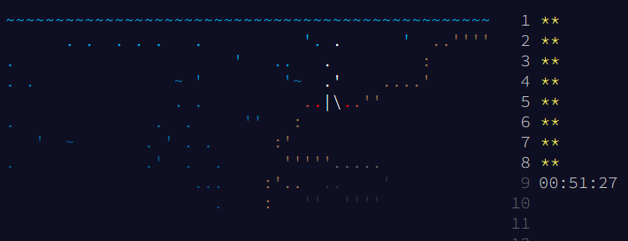

# AoC-2021-cplusplus

On Raspberry Pi4B aarch64 1.8GHz g++ 10.2.1 clang 11.0.1
Options: -std=gnu++20 -O3 -mtune=native

| Title | LOC | g++ time | clang++ time |
| --- | --- | --- | --- |
| Day 1: Sonar Sweep  | 52 | 390 us. | 481 us. |
| Day 2: Dive!  | 68 | 309 us. | 327 us. |
| Day 3: Binary Diagnostic  | 61 | 868 us. | 861 us. |
| Day 4: Giant Squid  | 117 | 1.025 ms. | 1.082 ms. |
| Day 5: Hydrothermal Venture  | 89 | 16.804 ms. | 17.019 ms. |
| Day 6: Lanternfish  | 40 | 198 us. | 192 us. |
| Day 7: The Treachery of Whales  | 58 | 13.371 ms. | 12.597 ms. |
| Day 8: Seven Segment Search  | 138 | 703 us. | 669 us. |
| Day 9: Smoke Basin  | 113 | 3.796 ms. | 3.319 ms. |
| Day 10: Syntax Scoring  | 110 | 1.157 ms. | 1.334 ms. |
| Day 11: Dumbo Octopus  | 86 | 1.132 ms. | 1.604 ms. |
| Day 12: Passage Pathing  | 92 | 190.286 ms. | 228.893 ms. |
| Day 13: Transparent Origami  | 105 | 2.812 ms. | 2.801 ms. |
| Day 14: Extended Polymerization  | 76 | 2.78 ms. | 2.625 ms. |
| Day 15: Chiton  | 84 | 251.823 ms. | 256.587 ms. |
| Day 16: Packet Decoder  | 145 | 214 us. | 233 us. |
| Day 17: Trick Shot  | 81 | 9.851 ms. | 8.607 ms. |
| Day 18: Snailfish  | 165 | 91.1 ms. | 103.778 ms. |
| Day 19: Beacon Scanner  | 182 | 56.59 ms. | 60.631 ms. |
| Day 20: Trench Map  | 72 | 56.547 ms. | 48.126 ms. |
| Day 21: Dirac Dice  | 114 | 563.916 ms. | 511.443 ms. |
| Day 22: Reactor Reboot  | 230 | 96.867 ms. | 97.283 ms. |
| Day 23: Amphipod  | 204 | 1.94556 s.  | 1.89454 s.  |
| Day 24: Arithmetic Logic Unit  | 70 | 168 us. | 176 us. |
| Day 25: Sea Cucumber  | 76 | 80.229 ms. | 78.739 ms. |

On Raspberry Pi Zero armv6l 1GHz g++ 10.2.1 clang 11.0.1
Options: -std=gnu++20 -O3 -mtune=native

| Title | LOC | g++ time | clang++ time |
| --- | --- | --- | --- |
| Day 1: Sonar Sweep  | 52 | 2.422 ms. | 2.583 ms. |
| Day 2: Dive!  | 68 | 1.645 ms. | 1.708 ms. |
| Day 3: Binary Diagnostic  | 61 | 6.554 ms. | 6.273 ms. |
| Day 4: Giant Squid  | 117 | 6.082 ms. | 6.558 ms. |
| Day 5: Hydrothermal Venture  | 89 | 109.881 ms. | 112.593 ms. |
| Day 6: Lanternfish  | 40 | 959 us. | 958 us. |
| Day 7: The Treachery of Whales  | 58 | 70.579 ms. | 53.242 ms. |
| Day 8: Seven Segment Search  | 138 | 4.097 ms. | 3.896 ms. |
| Day 9: Smoke Basin  | 113 | 16.417 ms. | 16.042 ms. |
| Day 10: Syntax Scoring  | 110 | 8.108 ms. | 7.872 ms. |
| Day 11: Dumbo Octopus  | 86 | 4.856 ms. | 5.683 ms. |
| Day 12: Passage Pathing  | 92 | 1.11385 s.  | 1.42692 s.  |
| Day 13: Transparent Origami  | 105 | 17.912 ms. | 17.781 ms. |
| Day 14: Extended Polymerization  | 76 | 18.691 ms. | 18.835 ms. |
| Day 15: Chiton  | 84 | 1.57551 s.  | 1.5744 s.  |
| Day 16: Packet Decoder  | 145 | 1.657 ms. | 1.544 ms. |
| Day 17: Trick Shot  | 81 | 50.066 ms. | 28.257 ms. |
| Day 18: Snailfish  | 165 | 697.877 ms. | 673.864 ms. |
| Day 19: Beacon Scanner  | 182 | 508.472 ms. | 489.594 ms. |
| Day 20: Trench Map  | 72 | 359.753 ms. | 313.395 ms. |
| Day 21: Dirac Dice  | 114 | 3.59052 s.  | 2.98355 s.  |
| Day 22: Reactor Reboot  | 230 | 652.425 ms. | 714.693 ms. |
| Day 23: Amphipod  | 204 | 13.5842 s.  | 12.2615 s.  |
| Day 24: Arithmetic Logic Unit  | 70 | 824 us. | 945 us. |
| Day 25: Sea Cucumber  | 76 | 227.895 ms. | 189.692 ms. |

On Raspberry Pi Zero 2 armv7l 1GHz g++ 10.2.1 clang 11.0.1
Options: -std=gnu++20 -O3 -mtune=native

| Title | LOC | g++ time | clang++ time |
| --- | --- | --- | --- |
| Day 1: Sonar Sweep  | 52 | 1.534 ms. | 1.634 ms. |
| Day 2: Dive!  | 68 | 1.005 ms. | 977 us. |
| Day 3: Binary Diagnostic  | 61 | 3.112 ms. | 3.132 ms. |
| Day 4: Giant Squid  | 117 | 3.57 ms. | 4.38 ms. |
| Day 5: Hydrothermal Venture  | 89 | 47.077 ms. | 51.081 ms. |
| Day 6: Lanternfish  | 40 | 449 us. | 427 us. |
| Day 7: The Treachery of Whales  | 58 | 46.543 ms. | 38.711 ms. |
| Day 8: Seven Segment Search  | 138 | 2.432 ms. | 2.25 ms. |
| Day 9: Smoke Basin  | 113 | 10.054 ms. | 9.697 ms. |
| Day 10: Syntax Scoring  | 110 | 5.14 ms. | 4.992 ms. |
| Day 11: Dumbo Octopus  | 86 | 3.141 ms. | 3.738 ms. |
| Day 12: Passage Pathing  | 92 | 481.637 ms. | 650.052 ms. |
| Day 13: Transparent Origami  | 105 | 8.16 ms. | 7.773 ms. |
| Day 14: Extended Polymerization  | 76 | 10.558 ms. | 10.906 ms. |
| Day 15: Chiton  | 84 | 643.948 ms. | 644.102 ms. |
| Day 16: Packet Decoder  | 145 | 651 us. | 668 us. |
| Day 17: Trick Shot  | 81 | 29.372 ms. | 18.345 ms. |
| Day 18: Snailfish  | 165 | 438.612 ms. | 442.217 ms. |
| Day 19: Beacon Scanner  | 182 | 263.122 ms. | 268.731 ms. |
| Day 20: Trench Map  | 72 | 267.253 ms. | 225.992 ms. |
| Day 21: Dirac Dice  | 114 | 2.19295 s.  | 2.03693 s.  |
| Day 22: Reactor Reboot  | 230 | 182.66 ms. | 232.303 ms. |
| Day 23: Amphipod  | 204 | 9.07544 s.  | 8.37301 s.  |
| Day 24: Arithmetic Logic Unit  | 70 | 260 us. | 255 us. |
| Day 25: Sea Cucumber  | 76 | 166.143 ms. | 141.869 ms. |

On Jetson Nano aarch64 1.5GHz g++ 10.3.0 clang 10.0.0
Options: -std=gnu++20 -O3 -mtune=native

| Title | LOC | g++ time | clang++ time |
| --- | --- | --- | --- |
| Day 1: Sonar Sweep  | 52 | 354 us. | 403 us. |
| Day 2: Dive!  | 68 | 246 us. | 302 us. |
| Day 3: Binary Diagnostic  | 61 | 880 us. | 1.106 ms. |
| Day 4: Giant Squid  | 117 | 1.149 ms. | 1.253 ms. |
| Day 5: Hydrothermal Venture  | 89 | 9.878 ms. | 12.006 ms. |
| Day 6: Lanternfish  | 40 | 122 us. | 137 us. |
| Day 7: The Treachery of Whales  | 58 | 16.284 ms. | 16.283 ms. |
| Day 8: Seven Segment Search  | 138 | 826 us. | 836 us. |
| Day 9: Smoke Basin  | 113 | 5.11 ms. | 4.694 ms. |
| Day 10: Syntax Scoring  | 110 | 1.492 ms. | 1.794 ms. |
| Day 11: Dumbo Octopus  | 86 | 1.53 ms. | 2.011 ms. |
| Day 12: Passage Pathing  | 92 | 238.857 ms. | 273.725 ms. |
| Day 13: Transparent Origami  | 105 | 3.508 ms. | 3.73 ms. |
| Day 14: Extended Polymerization  | 76 | 3.565 ms. | 3.838 ms. |
| Day 15: Chiton  | 84 | 278.534 ms. | 278.466 ms. |
| Day 16: Packet Decoder  | 145 | 227 us. | 276 us. |
| Day 17: Trick Shot  | 81 | 12.017 ms. | 10.527 ms. |
| Day 18: Snailfish  | 165 | 122.962 ms. | 159.591 ms. |
| Day 19: Beacon Scanner  | 182 | 82.065 ms. | 85.841 ms. |
| Day 20: Trench Map  | 72 | 67.944 ms. | 58.273 ms. |
| Day 21: Dirac Dice  | 114 | 742.747 ms. | 687.129 ms. |
| Day 22: Reactor Reboot  | 230 | 123.65 ms. | 122.953 ms. |
| Day 23: Amphipod  | 204 | 3.20866 s.  | 2.77639 s.  |
| Day 24: Arithmetic Logic Unit  | 70 | 81 us. | 90 us. |
| Day 25: Sea Cucumber  | 76 | 105.62 ms. | 101.148 ms. |

On Ryzen 7 3700X x86_64 5GHz g++ 11.2.0 clang 14.0.0
Options: -std=gnu++20 -O3 -mtune=native

| Title | LOC | g++ time | clang++ time |
| --- | --- | --- | --- |
| Day 1: Sonar Sweep  | 52 | 72 us. | 76 us. |
| Day 2: Dive!  | 68 | 60 us. | 64 us. |
| Day 3: Binary Diagnostic  | 61 | 182 us. | 179 us. |
| Day 4: Giant Squid  | 117 | 253 us. | 294 us. |
| Day 5: Hydrothermal Venture  | 89 | 1.402 ms. | 1.359 ms. |
| Day 6: Lanternfish  | 40 | 21 us. | 23 us. |
| Day 7: The Treachery of Whales  | 58 | 4.034 ms. | 3.992 ms. |
| Day 8: Seven Segment Search  | 138 | 199 us. | 176 us. |
| Day 9: Smoke Basin  | 113 | 1.356 ms. | 1.148 ms. |
| Day 10: Syntax Scoring  | 110 | 260 us. | 241 us. |
| Day 11: Dumbo Octopus  | 86 | 347 us. | 435 us. |
| Day 12: Passage Pathing  | 92 | 45.414 ms. | 50.685 ms. |
| Day 13: Transparent Origami  | 105 | 828 us. | 845 us. |
| Day 14: Extended Polymerization  | 76 | 892 us. | 895 us. |
| Day 15: Chiton  | 84 | 45.236 ms. | 44.388 ms. |
| Day 16: Packet Decoder  | 145 | 63 us. | 62 us. |
| Day 17: Trick Shot  | 81 | 2.734 ms. | 2.323 ms. |
| Day 18: Snailfish  | 165 | 28.622 ms. | 31.221 ms. |
| Day 19: Beacon Scanner  | 182 | 19.535 ms. | 20.144 ms. |
| Day 20: Trench Map  | 72 | 17.673 ms. | 18.718 ms. |
| Day 21: Dirac Dice  | 114 | 170.126 ms. | 176.498 ms. |
| Day 22: Reactor Reboot  | 230 | 20.138 ms. | 20.181 ms. |
| Day 23: Amphipod  | 204 | 575.578 ms. | 522.908 ms. |
| Day 24: Arithmetic Logic Unit  | 70 | 15 us. | 17 us. |
| Day 25: Sea Cucumber  | 76 | 33.395 ms. | 32.831 ms. |

On VisionFive RISC-V SiFive U74 Dual-Core 64-bit RV64GC

Options: -std=gnu++20 -O3

| Title | LOC | g++ time | clang++ time |
| --- | --- | --- | --- |
| Day 1: Sonar Sweep  | 52 | 1.475 ms. | 1.469 ms. |
| Day 2: Dive!  | 68 | 863 us. | 922 us. |
| Day 3: Binary Diagnostic  | 61 | 3.18 ms. | 3.053 ms. |
| Day 4: Giant Squid  | 117 | 2.922 ms. | 3.647 ms. |
| Day 5: Hydrothermal Venture  | 89 | 90.061 ms. | 88.483 ms. |
| Day 6: Lanternfish  | 40 | 398 us. | 349 us. |
| Day 7: The Treachery of Whales  | 58 | 35.168 ms. | 40.943 ms. |
| Day 8: Seven Segment Search  | 138 | 1.981 ms. | 1.845 ms. |
| Day 9: Smoke Basin  | 113 | 9.196 ms. | 9.335 ms. |
| Day 10: Syntax Scoring  | 110 | 4.412 ms. | 4.611 ms. |
| Day 11: Dumbo Octopus  | 86 | 2.586 ms. | 4.282 ms. |
| Day 12: Passage Pathing  | 92 | 636.692 ms. | 699.845 ms. |
| Day 13: Transparent Origami  | 105 | 9.951 ms. | 10.429 ms. |
| Day 14: Extended Polymerization  | 76 | 10.936 ms. | 10.429 ms. |
| Day 15: Chiton  | 84 | 1.08252 s.  | 1.10207 s.  |
| Day 16: Packet Decoder  | 145 | 749 us. | 821 us. |
| Day 17: Trick Shot  | 81 | 33.572 ms. | 45.709 ms. |
| Day 18: Snailfish  | 165 | 370.425 ms. | 418.688 ms. |
| Day 19: Beacon Scanner  | 182 | 259.318 ms. | 260.592 ms. |
| Day 20: Trench Map  | 72 | 156.586 ms. | 268.564 ms. |
| Day 21: Dirac Dice  | 114 | 3.84297 s.  | 1.81271 s.  |
| Day 22: Reactor Reboot  | 230 | 240.313 ms. | 942.321 ms. |
| Day 23: Amphipod  | 204 | 6.91559 s.  | 7.38928 s.  |
| Day 24: Arithmetic Logic Unit  | 70 | 310 us. | 218 us. |
| Day 25: Sea Cucumber  | 76 | 218.075 ms. | 148.033 ms. |

On ROCKPi4Se

| Title | LOC | g++ time | clang++ time |
| --- | --- | --- | --- |
| Day 1: Sonar Sweep  | 52 | 704 us. | 721 us. |
| Day 2: Dive!  | 68 | 452 us. | 422 us. |
| Day 3: Binary Diagnostic  | 61 | 1.697 ms. | 1.673 ms. |
| Day 4: Giant Squid  | 117 | 2.112 ms. | 2.198 ms. |
| Day 5: Hydrothermal Venture  | 89 | 23.769 ms. | 25.493 ms. |
| Day 6: Lanternfish  | 40 | 193 us. | 210 us. |
| Day 7: The Treachery of Whales  | 58 | 20.8 ms. | 21.464 ms. |
| Day 8: Seven Segment Search  | 138 | 1.027 ms. | 954 us. |
| Day 9: Smoke Basin  | 113 | 5.98 ms. | 5.74 ms. |
| Day 10: Syntax Scoring  | 110 | 2.341 ms. | 2.212 ms. |
| Day 11: Dumbo Octopus  | 86 | 1.949 ms. | 2.967 ms. |
| Day 12: Passage Pathing  | 92 | 195.969 ms. | 195.772 ms. |
| Day 13: Transparent Origami  | 105 | 4.856 ms. | 4.821 ms. |
| Day 14: Extended Polymerization  | 76 | 4.543 ms. | 4.41 ms. |
| Day 15: Chiton  | 84 | 311.409 ms. | 321.443 ms. |
| Day 16: Packet Decoder  | 145 | 422 us. | 428 us. |
| Day 17: Trick Shot  | 81 | 13.866 ms. | 15.8 ms. |
| Day 18: Snailfish  | 165 | 103.355 ms. | 113.685 ms. |
| Day 19: Beacon Scanner  | 182 | 70.802 ms. | 69.834 ms. |
| Day 20: Trench Map  | 72 | 67.444 ms. | 69.855 ms. |
| Day 21: Dirac Dice  | 114 | 554.58 ms. | 530.56 ms. |
| Day 22: Reactor Reboot  | 230 | 106.752 ms. | 109.901 ms. |
| Day 23: Amphipod  | 204 | 2.21351 s.  | 1.90361 s.  |
| Day 24: Arithmetic Logic Unit  | 70 | 137 us. | 142 us. |
| Day 25: Sea Cucumber  | 76 | 81.055 ms. | 77.457 ms. |

