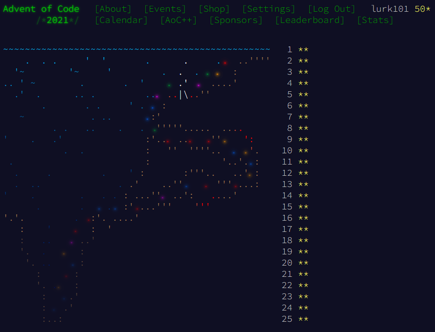

# AoC-2021-cplusplus

On Raspberry Pi4B

| Title | LOC | g++ time | clang++ time |
| --- | --- | --- | --- |
| Day 1: Sonar Sweep  | 52 | 341 us. | 386 us. |
| Day 2: Dive!  | 68 | 324 us. | 311 us. |
| Day 3: Binary Diagnostic  | 61 | 870 us. | 845 us. |
| Day 4: Giant Squid  | 117 | 1.099 ms. | 1.165 ms. |
| Day 5: Hydrothermal Venture  | 89 | 17.018 ms. | 17.13 ms. |
| Day 6: Lanternfish  | 40 | 162 us. | 199 us. |
| Day 7: The Treachery of Whales  | 58 | 12.861 ms. | 13.56 ms. |
| Day 8: Seven Segment Search  | 138 | 716 us. | 731 us. |
| Day 9: Smoke Basin  | 113 | 3.625 ms. | 3.859 ms. |
| Day 10: Syntax Scoring  | 110 | 1.182 ms. | 1.383 ms. |
| Day 11: Dumbo Octopus  | 86 | 1.142 ms. | 1.546 ms. |
| Day 12: Passage Pathing  | 92 | 169.454 ms. | 228.48 ms. |
| Day 13: Transparent Origami  | 105 | 2.664 ms. | 2.715 ms. |
| Day 14: Extended Polymerization  | 76 | 2.812 ms. | 2.728 ms. |
| Day 15: Chiton  | 85 | 268.145 ms. | 267.397 ms. |
| Day 16: Packet Decoder  | 145 | 311 us. | 297 us. |
| Day 17: Trick Shot  | 81 | 9.916 ms. | 8.596 ms. |
| Day 18: Snailfish  | 165 | 101.651 ms. | 104.853 ms. |
| Day 19: Beacon Scanner  | 164 | 1.12736 s.  | 1.17897 s.  |
| Day 20: Trench Map  | 72 | 59.925 ms. | 56.1 ms. |
| Day 21: Dirac Dice  | 114 | 537.555 ms. | 515.679 ms. |
| Day 22: Reactor Reboot  | 230 | 98.041 ms. | 95.804 ms. |
| Day 23: Amphipod  | 204 | 1.96895 s.  | 1.80066 s.  |
| Day 24: Arithmetic Logic Unit  | 70 | 84 us. | 86 us. |
| Day 25: Sea Cucumber  | 76 | 80.693 ms. | 75.289 ms. |

On Ryzen 7 3700X

| Title | LOC | Run time |
| --- | --- | --- | --- |
| Day 1: Sonar Sweep  | 52 | 85 us. |82 us. |
| Day 2: Dive!  | 68 | 60 us. |64 us. |
| Day 3: Binary Diagnostic  | 61 | 179 us. |182 us. |
| Day 4: Giant Squid  | 117 | 251 us. |319 us. |
| Day 5: Hydrothermal Venture  | 89 | 1.385 ms. |1.396 ms. |
| Day 6: Lanternfish  | 40 | 22 us. |25 us. |
| Day 7: The Treachery of Whales  | 58 | 4.058 ms. |4.012 ms. |
| Day 8: Seven Segment Search  | 138 | 200 us. |169 us. |
| Day 9: Smoke Basin  | 113 | 1.367 ms. |1.123 ms. |
| Day 10: Syntax Scoring  | 110 | 346 us. |337 us. |
| Day 11: Dumbo Octopus  | 86 | 347 us. |401 us. |
| Day 12: Passage Pathing  | 92 | 57.996 ms. |62.395 ms. |
| Day 13: Transparent Origami  | 105 | 845 us. |856 us. |
| Day 14: Extended Polymerization  | 76 | 897 us. |871 us. |
| Day 15: Chiton  | 85 | 44.221 ms. |44.519 ms. |
| Day 16: Packet Decoder  | 145 | 66 us. |64 us. |
| Day 17: Trick Shot  | 81 | 2.713 ms. |2.329 ms. |
| Day 18: Snailfish  | 165 | 29.361 ms. |31.362 ms. |
| Day 19: Beacon Scanner  | 164 | 400.692 ms. |412.556 ms. |
| Day 20: Trench Map  | 72 | 18.259 ms. |18.029 ms. |
| Day 21: Dirac Dice  | 114 | 172.23 ms. |176.888 ms. |
| Day 22: Reactor Reboot  | 230 | 20.267 ms. |20.644 ms. |
| Day 23: Amphipod  | 204 | 579.833 ms. |496.062 ms. |
| Day 24: Arithmetic Logic Unit  | 70 | 16 us. |19 us. |
| Day 25: Sea Cucumber  | 76 | 33.492 ms. |33.287 ms. |

